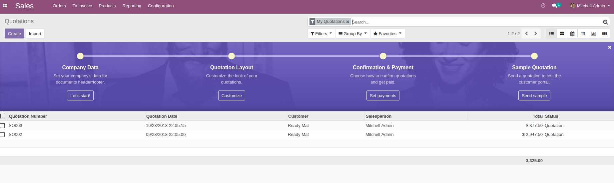

## Quick install

Installing Odoo 12 with one command.

(Supports multiple Odoo instances on one server)

Install [docker](https://docs.docker.com/get-docker/) and [docker-compose](https://docs.docker.com/compose/install/) yourself, then run:

```bash

curl -s https://raw.githubusercontent.com/aguennoune/odoo-12/master/odoo-one/run.sh | sudo bash -s odoo-one 10012 20012

```

to set up first Odoo instance @ `localhost:10012` (default master password: `minhng.info`)

and

```bash

curl -s https://raw.githubusercontent.com/aguennoune/odoo-12/master/odoo-two/run.sh | sudo bash -s odoo-two 11012 21012

```

to set up another Odoo instance @ `localhost:11012` (default master password: `minhng.info`)

Some arguments:

* First argument (**odoo-one**): Odoo deploy folder
* Second argument (**10012**): Odoo port
* Third argument (**20012**): live chat port

If `curl` is not found, install it:

```bash

$sudo apt-get install curl

# or

$sudo yum install curl

```

# Usage

Start the container:

```sh

docker-compose up

```

* Then open `localhost:10012` to access Odoo 12.0. If you want to start the server with a different port, change **10012** to another value in **docker-compose.yml**:

```

ports:

 - "10012:8069"

```

Run Odoo container in detached mode (be able to close terminal without stopping Odoo):

```

docker-compose up -d

```

**If you get the permission issue**, change the folder permission to make sure that the container is able to access the directory:

```sh

# $ git clone https://github.com/minhng92/odoo-12-docker-compose

# $ sudo chmod -R 777 addons

# $ sudo chmod -R 777 etc

# $ mkdir -p postgresql

# $ sudo chmod -R 777 postgresql

```

Increase maximum number of files watching from 8192 (default) to **524288**. In order to avoid error when we run multiple Odoo instances. This is an *optional step*. These commands are for Ubuntu user:

```

$ if grep -qF "fs.inotify.max_user_watches" /etc/sysctl.conf; then echo $(grep -F "fs.inotify.max_user_watches" /etc/sysctl.conf); else echo "fs.inotify.max_user_watches = 524288" | sudo tee -a /etc/sysctl.conf; fi

$ sudo sysctl -p    # apply new config immediately

```

# Custom addons

The **addons/** folder contains custom addons. Just put your custom addons if you have any.

# Odoo configuration & log

* To change Odoo configuration, edit file: **etc/odoo.conf**.
* Log file: **etc/odoo-server.log**
* Default database password (**admin_passwd**) is `minhng.info`, please change it @ [etc/odoo.conf#L55](/etc/odoo.conf#L55)

# Odoo container management

**Run Odoo**:

```bash

docker-compose up -d

```

**Restart Odoo**:

```bash

docker-compose restart

```

**Stop Odoo**:

```bash

docker-compose down

```

# Live chat

In [docker-compose.yml#L21](docker-compose.yml#L21), we exposed port **20012** for live-chat on host.

Configuring **nginx** to activate live chat feature (in production):

```conf

#...

server {

    #...

    location /longpolling/ {

        proxy_pass http://0.0.0.0:20012/longpolling/;

    }

    #...

}

#...

```

# docker-compose.yml

* odoo:12.0
* postgres:9.5

# Odoo 12 screenshots




# ----------------------------------------------

# How to replicate PostgreSQL

So far we've learnt how to run PostgreSQL as per [chapter 1](../1-introduction/README.md). `</br>`

We've also learnt how to configure PostgreSQL with our custom configuration file as per [chapter 2](../2-configuration/README.md). `</br>`

In this chapter we will setup a second PostgreSQL instance. `</br>`

Then we will learn how to configure our first PostgreSQL instance to replicate its data to the new second instance. `</br>`

This will essentially give us a primary and a secondary server for better availability in case we lose our primary server. `</br>`

## Issue with an already existing container of PostgreSQL up and running in docker:

##### Solution suggested with @ `GitHub Copilot` (AI pair programmer)

Bonjour,

Pour ajouter un nouveau service PostgreSQL à votre fichier `docker-compose.yml` existant et le configurer pour répliquer ses données vers une nouvelle instance, vous pouvez suivre les étapes suivantes :

1. Ajoutez un nouveau service à votre fichier `docker-compose.yml` pour la deuxième instance de PostgreSQL. Vous pouvez le nommer `db_replica` par exemple.

```dockercompose

db_replica:

  container_name: db_replica

  image: postgres:14

  user: root

  environment:

    - POSTGRES_PASSWORD=odoo

    - POSTGRES_USER=odoo_user

    - POSTGRES_DB=db_dev

    - PGDATA=/data_replica

  ports:

    - "5434:5432"

  restart: always

  volumes:

    - ./config:/config/

    - ./pgdata_replica:/data_replica

```

2. Pour configurer la réplication, vous devez d'abord configurer votre instance principale pour accepter les connexions de réplication. Vous pouvez le faire en ajoutant les variables d'environnement suivantes à votre service `db` :

```dockercompose

environment:

  - POSTGRES_PASSWORD=odoo

  - POSTGRES_USER=odoo_user

  - POSTGRES_DB=db_dev

  - PGDATA=/data

  - POSTGRES_HOST_AUTH_METHOD=trust

  - POSTGRES_WAL_LEVEL=replica

  - POSTGRES_MAX_WAL_SENDERS=5

  - POSTGRES_WAL_KEEP_SEGMENTS=32

```

3. Ensuite, vous devez configurer votre instance de réplica pour se connecter à l'instance principale. Vous pouvez le faire en ajoutant les variables d'environnement suivantes à votre service `db_replica` :

```dockercompose

environment:

  - POSTGRES_PASSWORD=odoo

  - POSTGRES_USER=odoo_user

  - POSTGRES_DB=db_dev

  - PGDATA=/data_replica

  - POSTGRES_HOST_AUTH_METHOD=trust

  - POSTGRES_REPLICATE_FROM=db

```

**Note**: Notez que `POSTGRES_REPLICATE_FROM` doit correspondre au nom du service de votre instance principale.

Veuillez noter que cette configuration est très basique et n'inclut pas de sécurité pour les connexions de réplication. Dans un environnement de production, vous devriez sécuriser ces connexions en utilisant des méthodes d'authentification appropriées.

## Prerequisites

So as to configure our first PostgreSQL instance to replicate its data to the new second instance, and to troubleshooting an already existing container of PostgreSQL up and running in docker, the purpose here is to essentially give us a primary and a secondary server for better availability in case we lose our primary server. How to add a service PostgreSQL to an existing docker-compose.yml file, and how to configure it to replicate its data to the new second instance. `</br>`

## Get our Primary PostgreSQL up and running

Let's start by running our primary PostgreSQL in docker `</br>`

Few things to note here: `</br>`

* We start our instance with a different name to identify it as the first instance with the `--name odoo-one` flag and `two` for the second instance
* Set unique data volumes for data between instances
* Set unique config files for each instance
* Create and run our docker containers on the same network

Create a new network so our instances can talk with each other:

```

docker network create odoo-web

```

Start with instance 1:

```

cd odoo-12/


docker run -it --rm --name odoo-one `

--net odoo-web `

-e POSTGRES_USER=odoo_user `

-e POSTGRES_PASSWORD=odoo `

-e POSTGRES_DB=db_dev `

-e PGDATA="/data" `

-v ${PWD}/pgdata:/data `

-v ${PWD}/config:/config `

-v ${PWD}/archive:/mnt/server/archive `

-p 5433:5432 `

postgres:14.0 -c 'config_file=/config/postgresql.conf'

```

## Create Replication User

In order to take a backup we will use a new PostgreSQL user account which has the permissions to do replication. `</br>`

Let's create this user account by logging into `odoo-one`:

```

docker exec -it odoo-one bash


# create a new user

createuser -U odoo_user -P -c 5 --replication replicationUser


exit

```

# Enable Write-Ahead Log and Replication

There is quite a lot to read about PostgreSQL when it comes to high availability. `</br>`

The first thing we want to take a look at is [WAL](https://www.postgresql.org/docs/current/wal-intro.html) `</br>`

Basically PostgreSQL has a mechanism of writing transaction logs to file and does not accept the transaction until its been written to the transaction log and flushed to disk. `</br>`

This ensures that if there is a crash in the system, that the database can be recovered from the transaction log. `</br>`

Hence it is "writing ahead". `</br>`

More documentation for configuration [wal_level](https://www.postgresql.org/docs/current/runtime-config-wal.html) and [max_wal_senders](https://www.postgresql.org/docs/current/runtime-config-replication.html)

```

wal_level = replica

max_wal_senders = 3

```

# Enable Archive

More documentation for configuration [archive_mode](https://www.postgresql.org/docs/current/runtime-config-wal.html#GUC-ARCHIVE-MODE)

```

archive_mode = on

archive_command = 'test ! -f /mnt/server/archive/%f && cp %p /mnt/server/archive/%f'


```

## Take a base backup

To take a database backup, we'll be using the [pg_basebackup](https://www.postgresql.org/docs/current/app-pgbasebackup.html) utility. `</br>`

The utility is in the PostgreSQL docker image, so let's run it without running a database as all we need is the `pg_basebackup` utility. `<br/>`

Note that we also mount our blank data directory as we will make a new backup in there:

```

cd odoo-12/ # PWD=odoo-two


docker run -it --rm `

--net postgres `

-v ${PWD}/pgdata:/data `

--entrypoint /bin/bash postgres:14.0

```

Take the backup by logging into `odoo-one` with our `replicationUser` and writing the backup to `/data`.

```

pg_basebackup -h odoo-one -p 5432 -U replicationUser -D /data/ -Fp -Xs -R

```

Now we should see PostgreSQL data ready for our second instance in `${PWD}/pgdata` # `${PWD}/postgres-2/pgdata`

## Start standby instance

```

cd odoo-12/ # PWD=odoo-two


docker run -it --rm --name odoo-two `

--net odoo-web `

-e POSTGRES_USER=odoo_user `

-e POSTGRES_PASSWORD=odoo `

-e POSTGRES_DB=db_dev `

-e PGDATA="/data" `

-v ${PWD}/pgdata:/data `

-v ${PWD}/config:/config `

-v ${PWD}/archive:/mnt/server/archive `

-p 5050:5432 `

postgres:14.0 -c 'config_file=/config/postgresql.conf'

```

## Test the replication

Let's test our replication by creating a new table in `odoo-one</br>`

On our primary instance, lets do that:

```

# login to postgres

psql --username=odoo_user db_dev


#create a table

CREATE TABLE customers (firstname text, customer_id serial, date_created timestamp);


#show the table

\dt

```

Now lets log into our `odoo-two` instance and view the table:

```

docker exec -it odoo-two bash


# login to postgres

psql --username=odoo_user db_dev


#show the tables

\dt

```

## Failover

Now lets say `odoo-one` fails. `</br>`

PostgreSQL does not have built-in automated failver and recovery and requires tooling to perform this. `</br>`

When `odoo-one` fails, we would use a utility called [pg_ctl](https://www.postgresql.org/docs/current/app-pg-ctl.html) to promote our stand-by server to a new primary server. `</br>`

Then we have to build a new stand-by server just like we did in this guide. `</br>`

We would also need to configure replication on the new primary, the same way we did in this guide. `</br>`

Let's stop the primary server to simulate failure:

```

docker rm -f odoo-one

```

Then log into `odoo-two` and promote it to primary:

```

docker exec -it odoo-two bash


# confirm we cannot create a table as its a stand-by server

CREATE TABLE customers (firstname text, customer_id serial, date_created timestamp);


# run pg_ctl as postgres user (cannot be run as root!)

runuser -u postgres -- pg_ctl promote


# confirm we can create a table as its a primary server

CREATE TABLE customers (firstname text, customer_id serial, date_created timestamp);

```

That's it for chapter three! `</br>`

Now we understand how to [run PostgreSQL](../1-introduction/README.md), how to [configure PostgreSQL](../2-configuration/README.md) and how to setup replication for better availability.

## Summary

<imgsrc="./summary.png"alt="Summary">

Tutorial with @marcel-dempers


Thanks to :


* [minhng92](https://github.com/minhng92)/[odoo-12-docker-compose](https://github.com/minhng92/odoo-12-docker-compose)
* [Marcel Dempers](https://github.com/marcel-dempers)/[docker-development-youtube-series](https://github.com/marcel-dempers/docker-development-youtube-series)
